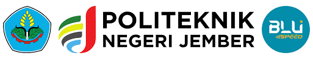
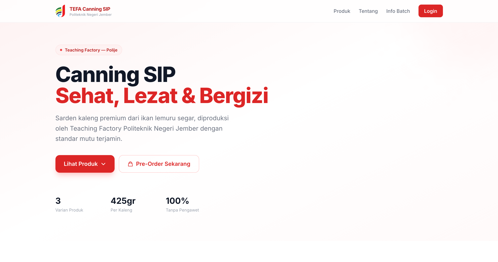
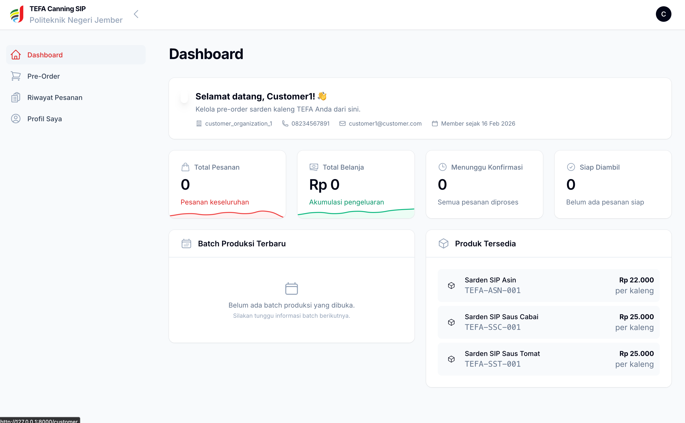
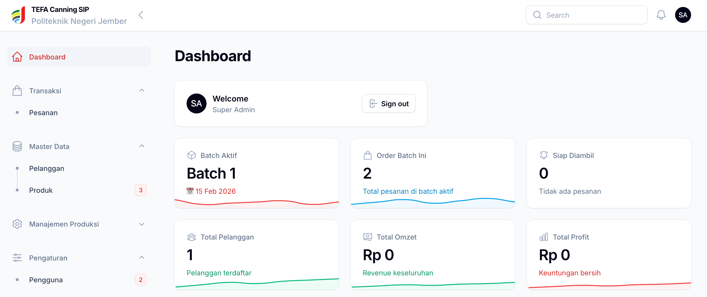

  
  <h1>TEFA Canning SIP</h1>
  
<strong>Teaching Factory Sardine Canning — Transaction & Monitoring System</strong>

  
Sistem transaksi dan monitoring pre-order sarden kaleng berbasis batch Politeknik Negeri Jember

   

  
  
  <!--  -->
  
  

    

  

---

## 📋 Tentang

Sistem informasi berbasis web untuk mendigitalisasi proses transaksi dan monitoring di Teaching Factory pengalengan ikan sarden. Mengadopsi model **Pre-Order Berbasis Batch** yang terintegrasi dengan event kampus.

---

## ✨ Core Features

| Fitur | Deskripsi |
|-------|-----------|
| 🛒 **Pre-Order Berbasis Batch** | Pelanggan memesan produk dalam periode batch yang terhubung dengan event kampus |
| 📊 **Dashboard & Monitoring** | Visualisasi data penjualan, statistik pesanan, dan laporan keuangan |
| 👥 **Multi-Panel System** | Panel terpisah untuk Admin, Teknisi, dan Customer dengan hak akses berbeda |
| 📄 **Laporan PDF** | Generate laporan pesanan otomatis dengan branding profesional |
| 📱 **Notifikasi WhatsApp** | Konfirmasi pesanan & notifikasi pengambilan otomatis via WhatsApp |
| 🔐 **Role-Based Access** | Superadmin, Teknisi, dan Customer dengan permission granular |
| 📋 **Audit Trail** | Pencatatan otomatis semua aktivitas untuk transparansi |
| 🗃️ **Manajemen Data** | CRUD lengkap untuk Batch, Produk, Pesanan, dan Pelanggan |

---

## 📖 Reason 

Sistem ini dirancang sebagai implementasi langsung dari mata kuliah **Workshop Proyek Perangkat Lunak (Semester 2)** di **Politeknik Negeri Jember**. Proyek ini dibuat untuk memenuhi tugas mata kuliah **Workshop Proyek Perangkat Lunak (Semester 2)** di **Politeknik Negeri Jember**.

---

## 💻 Preview

- Landing page :

- Customer dashboard :

- Admin dashboard :

---

## 📄 Lisensi

Proyek ini dilindungi di bawah lisensi **PolyForm Noncommercial License 1.0.0**.

Anda diperbolehkan untuk:
- ✅ Melihat dan mempelajari kode sumber (Source Available).
- ✅ Mengubah kode untuk keperluan pribadi atau edukasi.
- ✅ Membagikan ulang salinan proyek ini dengan menyertakan lisensi yang sama.

Anda **DILARANG** untuk:
- ❌ Menggunakan kode ini untuk tujuan komersial (dijual atau dijadikan layanan berbayar).
- ❌ Menggunakan kode ini untuk kepentingan perusahaan tanpa izin tertulis.

Lihat file [LICENSE](LICENSE) untuk detail lengkapnya.

Dikembangkan untuk **Teaching Factory Pengalengan Ikan** — Politeknik Negeri Jember.

---

  Built with ❤️ by TEFA Canning Team — Politeknik Negeri Jember

