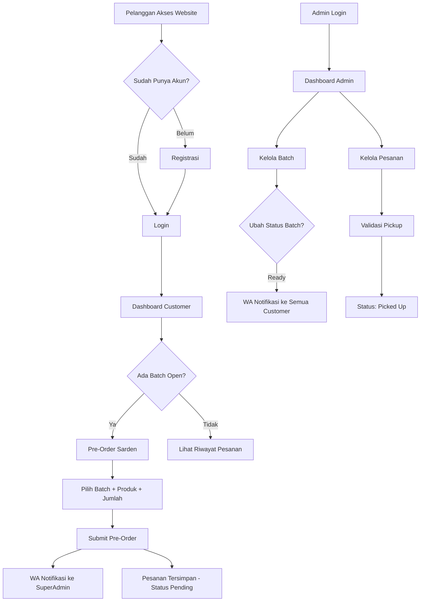

# LAPORAN DESIGN SPRINT
## Sistem Informasi Transaksi dan Monitoring Pre-Order Sarden Kaleng Berbasis Batch — TEFA Canning SIP

**Mata Kuliah:** Workshop Proyek Pengembangan Perangkat Lunak  
**Program Studi:** Teknik Informatika  
**Institusi:** Politeknik Negeri Jember  
**Tahun Akademik:** 2025/2026  
**Minggu Praktikum:** Minggu 4

---

## Ringkasan Design Sprint

| Fase | Kegiatan | Status |
|------|----------|:------:|
| 1. Understand | Memahami masalah pengguna | ✅ Selesai |
| 2. Define | Menentukan fokus masalah | ✅ Selesai |
| 3. Sketch | Mengembangkan ide solusi | ✅ Selesai |
| 4. Decide | Memilih solusi terbaik | ✅ Selesai |
| 5. Prototype | Membuat prototipe di Figma | ✅ Selesai |
| 6. Test/Validate | Menguji ke pengguna | ⬜ Belum dilaksanakan |

---

## 1. Tahap Understand (Memahami Masalah)

### 1.1 Latar Belakang Masalah

Teaching Factory (TEFA) Canning di Politeknik Negeri Jember adalah unit usaha pengalengan ikan sarden di lingkungan kampus yang memproduksi 3 varian produk: Sarden Saus Tomat, Sarden Asam Manis, dan Sarden Saus Cabai.

### 1.2 Masalah yang Ditemukan

Berdasarkan observasi dan wawancara, ditemukan **5 masalah utama:**

| No | Masalah | Dampak |
|----|---------|--------|
| 1 | Pencatatan pesanan **masih manual** | Rawan kesalahan, duplikasi data |
| 2 | **Tidak ada monitoring** real-time volume penjualan | Sulit merencanakan produksi |
| 3 | **Tidak bisa melacak** riwayat transaksi pelanggan | Data pelanggan tidak persisten |
| 4 | Pembuatan **laporan keuangan manual** | Memakan waktu, berpotensi tidak akurat |
| 5 | **Komunikasi status pesanan** tidak terstruktur | Pelanggan tidak tahu kapan pesanan siap |

### 1.3 Stakeholder yang Terlibat

| Stakeholder | Peran | Kebutuhan Utama |
|-------------|-------|-----------------|
| Pemilik TEFA | Owner / Super Admin | Monitoring keuangan (omzet, profit), kontrol harga |
| Teknisi Produksi | Operator | Mengetahui volume produksi per batch, validasi pickup |
| Pelanggan | Customer | Kemudahan memesan, tracking status pesanan |
| Dosen Pembimbing | Pengarah | Memastikan proyek sesuai kurikulum |

### 1.4 Tujuan Sprint

> Mengembangkan sistem informasi berbasis web yang mendigitalisasi proses transaksi pre-order sarden kaleng dengan model **batch berbasis event kampus**, dilengkapi monitoring dashboard dan notifikasi otomatis.

---

## 2. Tahap Define (Menentukan Fokus Masalah)

### 2.1 Problem Statement

*"Bagaimana cara mendigitalisasi sistem transaksi TEFA Canning yang saat ini masih manual, agar dapat mengelola pesanan secara efisien, memonitor penjualan real-time, dan berkomunikasi otomatis dengan pelanggan?"*

### 2.2 Target Pengguna

| Persona | Deskripsi | Goal Utama |
|---------|-----------|------------|
| **Pelanggan** | Masyarakat umum, komunitas kampus, organisasi | Memesan sarden dengan mudah, mengetahui status pesanan |
| **Super Admin** | Pemilik/pengelola TEFA | Monitoring keuangan, kontrol penuh sistem |
| **Teknisi** | Staf produksi | Mengetahui volume produksi, validasi pengambilan barang |

### 2.3 Batasan Masalah

1. Model bisnis: **Pre-Order Berbasis Batch** (hanya bisa order saat batch open)
2. Pembayaran: manual di luar sistem (tanpa payment gateway)
3. Notifikasi: via WhatsApp (Fonnte API)
4. Platform: **Web responsive** (bukan mobile native)
5. Produk: 3 varian sarden kaleng (SST, ASN, SSC)
6. Hosting: shared hosting (tanpa SSH)

---

## 3. Tahap Sketch (Mengembangkan Ide & Solusi)

### 3.1 Ide Solusi yang Dihasilkan

Berdasarkan diskusi tim, dihasilkan beberapa ide solusi:

| No | Ide Solusi | Kelebihan | Kekurangan |
|----|-----------|-----------|------------|
| 1 | Aplikasi mobile native | UX terbaik, push notification | Waktu dev lama, butuh publish ke store |
| 2 | Sistem web + WhatsApp Bot | Aksesibel, murah hosting | Kurang rich UI di WhatsApp |
| 3 | **Web app multi-panel + WhatsApp API** | Aksesibel, dashboard lengkap, notifikasi WA | Butuh koneksi internet |
| 4 | Spreadsheet + Google Forms | Cepat dibuat, gratis | Tidak scalable, sulit monitoring |

### 3.2 Wireframe / Sketsa Awal

Sketsa awal sistem mencakup 3 area utama:

```
┌─────────────────────────────────────────────────────┐
│                  TEFA CANNING SIP                    │
├─────────────┬──────────────────┬────────────────────┤
│             │                  │                    │
│  Landing    │  Customer Panel  │   Admin Panel      │
│  Page (/)   │  (/customer)     │   (/admin)         │
│             │                  │                    │
│  • Hero     │  • Dashboard     │  • Dashboard       │
│  • Katalog  │  • Pre-Order     │  • Kelola Pesanan  │
│  • Batch    │  • Riwayat       │  • Master Data     │
│  • SNI      │  • Edit Order    │  • Kelola Batch    │
│  • About    │  • Edit Profil   │  • Audit Log       │
│  • Footer   │                  │  • Manajemen User  │
│             │                  │                    │
└─────────────┴──────────────────┴────────────────────┘
```

---

## 4. Tahap Decide (Memilih Solusi Terbaik)

### 4.1 Solusi yang Dipilih

**Solusi #3: Web App Multi-Panel + WhatsApp API** dipilih berdasarkan evaluasi:

| Kriteria | Skor (1-5) | Alasan |
|----------|:----------:|--------|
| Kebutuhan pengguna | 5 | Semua user bisa akses via browser tanpa install |
| Dampak solusi | 5 | Dashboard monitoring + notifikasi otomatis |
| Keterbatasan waktu | 4 | Framework Laravel + Filament mempercepat development |
| Sumber daya | 4 | Shared hosting murah, Fonnte API terjangkau |
| **Total** | **18/20** | |

### 4.2 Workflow System (Flowchart)



> 📊 Flowchart lengkap: `docs/flowchart-system.mmd`

### 4.3 Prioritas Fitur

| Prioritas | Fitur | Keterangan |
|:---------:|-------|------------|
| 🔴 P1 | Pre-Order Batch System | Fitur inti — customer bisa pesan sarden |
| 🔴 P1 | Dashboard Admin | Monitoring pesanan dan status batch |
| 🔴 P1 | Kelola Batch (CRUD) | Siklus hidup batch: Open → Processing → Ready → Closed |
| 🟡 P2 | Notifikasi WhatsApp | Otomatisasi komunikasi ke customer & admin |
| 🟡 P2 | Laporan PDF | Cetak bukti pesanan (admin & customer) |
| 🟡 P2 | Role-Based Access | Super Admin vs Teknisi (beda akses keuangan) |
| 🟢 P3 | Audit Log | Tracking perubahan data untuk transparansi |
| 🟢 P3 | Landing Page | Etalase digital produk |
| ⚪ P4 | QR Code Pickup | *Future enhancement* |
| ⚪ P4 | Payment Gateway | *Future enhancement* |

---

## 5. Tahap Prototype (Membuat Prototipe)

### 5.1 Informasi Prototype

| Elemen | Keterangan |
|--------|------------|
| **Jenis Prototype** | ☑ High-Fidelity |
| **Platform** | ☑ Web |
| **Tools** | Figma |
| **Link Figma** | [FIGMA WPL Design](https://www.figma.com/design/PbnoM9TlYUhoh9jiULKGyf/FIGMA-WPL?node-id=270-2) |

### 5.2 Daftar Screen yang Didesain

#### A. Halaman Publik (Landing Page)

| No | Screen | Deskripsi |
|----|--------|-----------|
| 1 | Hero Section | Tagline, statistik, CTA button |
| 2 | Katalog Produk | 3 kartu produk (SST, ASN, SSC) |
| 3 | Informasi Batch | Batch yang sedang open |
| 4 | Disclaimer SNI | Banner peringatan |
| 5 | Tentang Kami | Deskripsi + logo kemitraan |
| 6 | Footer | 4-column layout + Google Maps |

#### B. Panel Customer

| No | Screen | Deskripsi |
|----|--------|-----------|
| 7 | Registrasi | Form 7 field + validasi |
| 8 | Login Customer | Email + password |
| 9 | Dashboard | 4 widget (Welcome, Order Summary, Latest Batch, Products) |
| 10 | Pre-Order | Form pilih batch + repeater produk |
| 11 | Riwayat Pesanan | Tabel pesanan + aksi (Edit, PDF, Hapus) |
| 12 | Edit Pesanan | Form edit (batch locked) |
| 13 | Edit Profil | Data diri + ubah password |

#### C. Panel Admin

| No | Screen | Deskripsi |
|----|--------|-----------|
| 14 | Login Admin | Branding TEFA Canning |
| 15 | Dashboard SuperAdmin | 6 widget (termasuk omzet & profit) |
| 16 | Dashboard Teknisi | 4 widget (tanpa keuangan) |
| 17 | Kelola Pesanan | Tabel + filter + aksi pickup |
| 18 | Kelola Pelanggan | Tabel CRUD + relation table |
| 19 | Kelola Produk | Tabel + proteksi harga & hapus |
| 20 | Kelola Batch | Tabel + form status lifecycle |
| 21 | Audit Log | Tabel read-only + detail old/new |
| 22 | Manajemen Pengguna | Tabel CRUD + proteksi delete |

#### D. Lainnya

| No | Screen | Deskripsi |
|----|--------|-----------|
| 23 | Laporan PDF | Header Polije + tabel produk + footer 3 logo |
| 24 | Notifikasi WhatsApp | Format pesan otomatis |

### 5.3 User Flow yang Diimplementasikan

| No | User Flow | Referensi |
|----|-----------|-----------|
| 1 | Registrasi Akun | `docs/userflow-2.3.1-registrasi.mmd` |
| 2 | Login Pelanggan | `docs/userflow-2.3.2-login.mmd` |
| 3 | Dashboard Pelanggan | `docs/userflow-2.3.3-dashboard.mmd` |
| 4 | Pre-Order Sarden | `docs/userflow-2.3.4-preorder.mmd` |
| 5 | Riwayat Pesanan | `docs/userflow-2.3.5-riwayat.mmd` |
| 6 | Master Data | `docs/userflow-2.3.6-masterdata.mmd` |
| 7 | Manajemen Produksi | `docs/userflow-2.3.7-produksi.mmd` |
| 8 | Audit Log | `docs/userflow-2.3.8-auditlog.mmd` |
| 9 | Manajemen Pengguna | `docs/userflow-2.3.9-pengaturan.mmd` |

### 5.4 Identitas Visual / Brand

| Elemen | Nilai |
|--------|-------|
| Warna Primary | `#DC2626` (Red-600) |
| Warna Accent | `#EF4444` (Red-500) |
| Warna Dark | `#991B1B` (Red-800) |
| Font | Inter |
| Logo | Politeknik Negeri Jember (merah untuk dark mode) |

---

## 6. Tahap Test / Validate (Pengujian Prototype)

> ⚠️ **Status: Belum dilaksanakan** — Pengujian tertunda karena keterbatasan komunikasi dengan pemilik TEFA Canning.

*Section ini akan dilengkapi setelah user testing dilaksanakan menggunakan template di bawah.*

---

# TEMPLATE PENGUJIAN PROTOTYPE (USER TESTING)

> Template ini sesuai dengan format **Acara 7 — BKPM Minggu 4/2**

## A. Identitas Proyek

| Elemen | Keterangan |
|--------|------------|
| **Nama Proyek** | TEFA Canning SIP — Sistem Informasi Transaksi dan Monitoring Pre-Order Sarden Kaleng |
| **Kelompok** | *(isi nama kelompok)* |
| **Anggota Kelompok** | *(isi daftar anggota)* |
| **Jenis Prototype** | ☑ High-Fidelity |
| **Platform** | ☑ Web |
| **Tanggal Pengujian** | *(isi tanggal saat testing)* |
| **Lokasi Pengujian** | *(isi lokasi — misal: Lab Komputer JTI Polije)* |

## B. Profil Responden

| No | Inisial | Usia | Pekerjaan/Peran | Pengalaman dengan Sistem Serupa |
|:--:|---------|:----:|-----------------|--------------------------------|
| 1 | | | | |
| 2 | | | | |
| 3 | | | | |
| 4 | | | | |
| 5 | | | | |

> **Tips:** Pilih responden yang mewakili ketiga persona: pelanggan, admin/superadmin, dan teknisi.

## C. Tujuan Pengujian

Tujuan utama dari pengujian prototype ini adalah:

1. Menguji **kemudahan penggunaan** fitur utama (pre-order, riwayat pesanan, dashboard admin)
2. Menilai **kesesuaian solusi** dengan kebutuhan pengguna TEFA Canning
3. Mengidentifikasi **kendala atau kebingungan** pengguna saat navigasi sistem
4. Mengukur **kejelasan tampilan** dan alur penggunaan

**Tujuan Pengujian:** *(tulis ringkasan di sini)*

## D. Skenario Pengujian

| No | Skenario Pengujian | Berhasil | Tidak | Catatan |
|:--:|-------------------|:--------:|:-----:|---------|
| 1 | Responden melakukan **registrasi** akun customer baru | ☐ | ☐ | |
| 2 | Responden **login** ke panel customer | ☐ | ☐ | |
| 3 | Responden membuat **pre-order** sarden (pilih batch, tambah produk, submit) | ☐ | ☐ | |
| 4 | Responden melihat **riwayat pesanan** dan mencoba edit pesanan pending | ☐ | ☐ | |
| 5 | Responden mengunduh **laporan PDF** pesanan | ☐ | ☐ | |
| 6 | Responden membuka **dashboard admin** dan memahami statistik yang ditampilkan | ☐ | ☐ | |
| 7 | Responden melakukan **validasi pickup** pesanan (klik tombol Pickup) | ☐ | ☐ | |
| 8 | Responden mengubah **status batch** dari Open ke Processing | ☐ | ☐ | |

## E. Hasil Observasi Pengujian

| Aspek yang Dinilai | Sangat Baik | Baik | Cukup | Kurang | Catatan |
|-------------------|:----------:|:----:|:-----:|:------:|---------|
| Kemudahan penggunaan | ☐ | ☐ | ☐ | ☐ | |
| Kejelasan tampilan | ☐ | ☐ | ☐ | ☐ | |
| Alur penggunaan | ☐ | ☐ | ☐ | ☐ | |
| Kesesuaian fitur | ☐ | ☐ | ☐ | ☐ | |
| Kecepatan memahami sistem | ☐ | ☐ | ☐ | ☐ | |

## F. Umpan Balik Langsung dari Pengguna

### 1. Hal yang Disukai Pengguna
*(tulis di sini)*

### 2. Kendala yang Ditemukan
*(tulis di sini)*

### 3. Saran Perbaikan dari Pengguna
*(tulis di sini)*

## G. Kesimpulan Hasil Validasi

Berdasarkan hasil pengujian prototype, dapat disimpulkan bahwa:

- ☐ Prototype **layak dikembangkan** ke tahap implementasi
- ☐ Prototype **perlu perbaikan** sebelum dikembangkan
- ☐ Prototype **tidak layak dilanjutkan**

**Alasan:** *(tulis alasan di sini)*

## H. Rekomendasi Tindak Lanjut

| No | Temuan Masalah | Rekomendasi Perbaikan |
|:--:|----------------|----------------------|
| 1 | | |
| 2 | | |
| 3 | | |

## I. Dokumentasi Pengujian

*(Lampirkan screenshot, foto, atau link video proses user testing)*

## J. Pengesahan

| Pihak | Nama | Tanda Tangan | Tanggal |
|-------|------|:------------:|---------|
| Ketua Kelompok | | | |
| Dosen Pengampu | | | |
