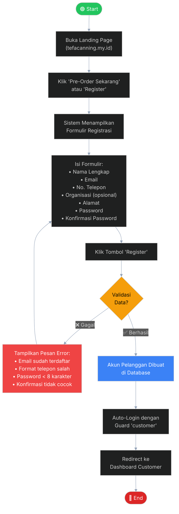
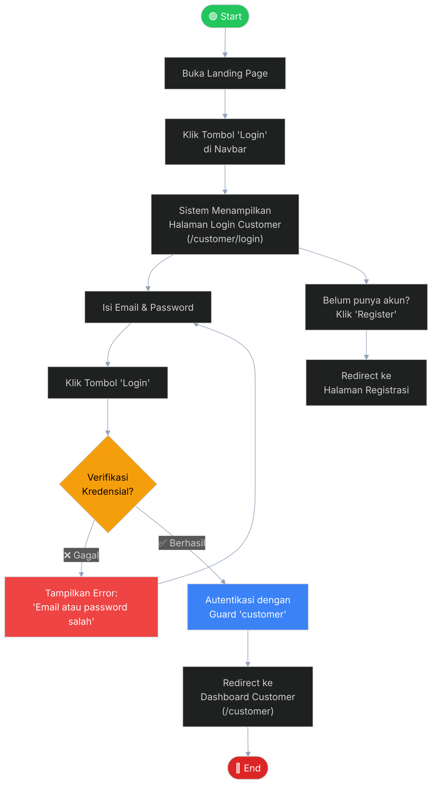
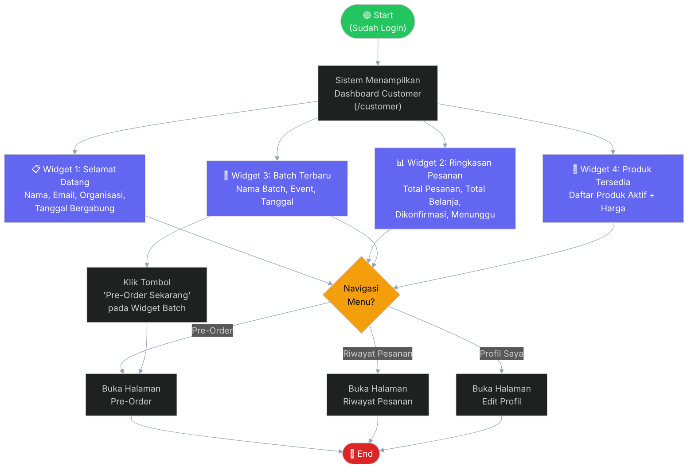
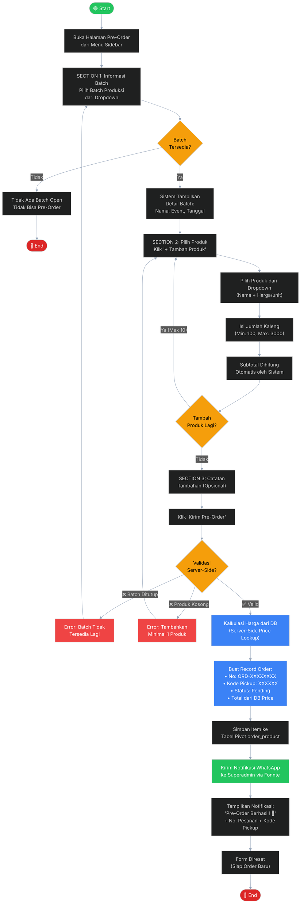
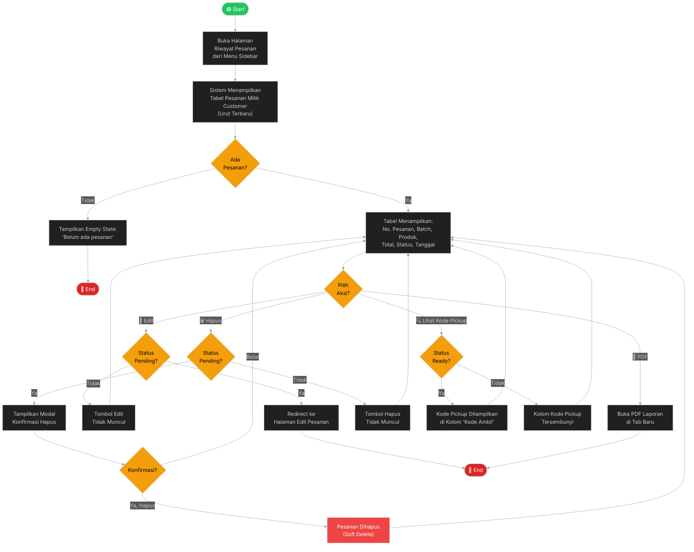
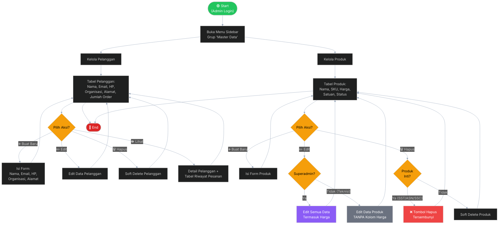
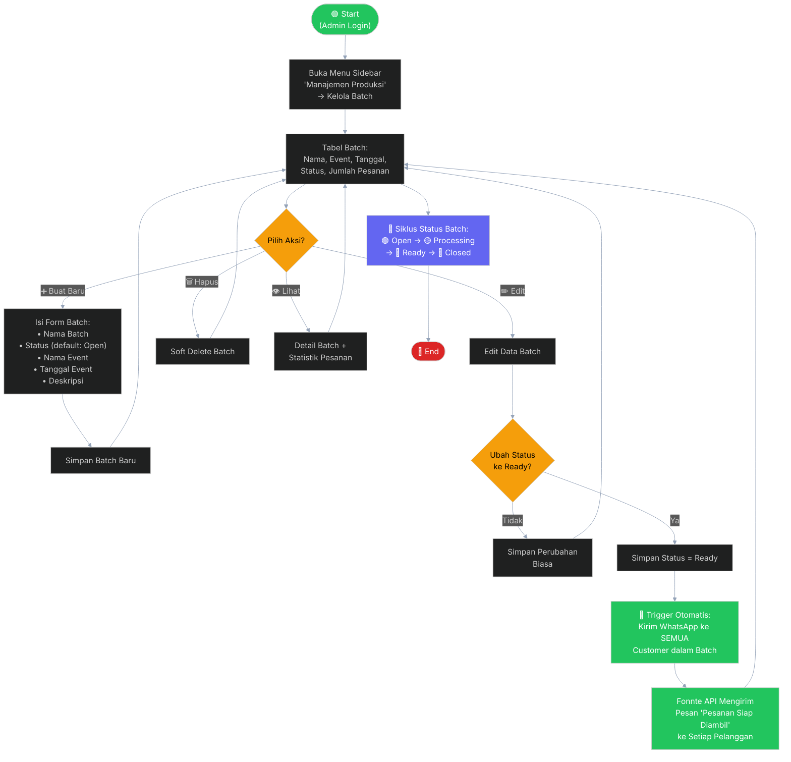
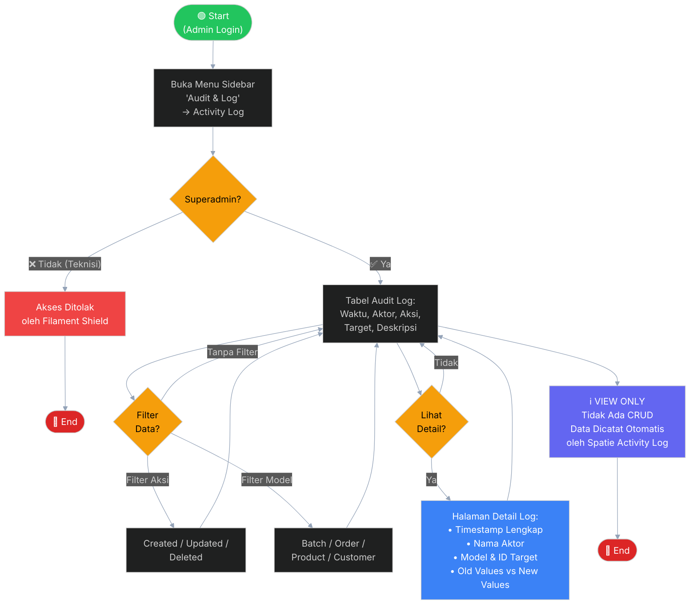
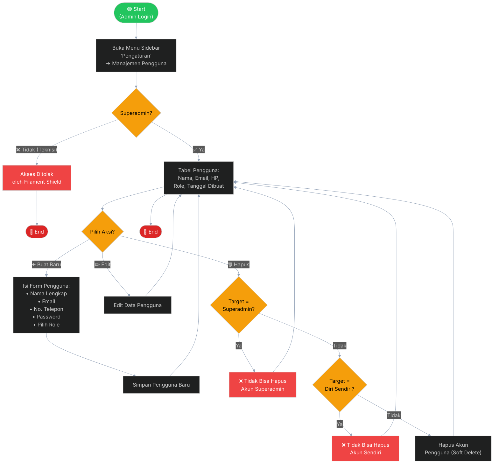

# User Flow Per Fitur — TEFA Canning SIP

> Dokumen ini berisi diagram user flow (Mermaid) untuk setiap fitur pada BAB II laporan.
> Setiap diagram berdiri sendiri, memiliki arah top-down (TD), dan tidak ada garis yang bersilangan.

---

## 2.3.1 User Flow — Registrasi Akun

---

## 2.3.2 User Flow — Login Pelanggan

---

## 2.3.3 User Flow — Dashboard Pelanggan

---

## 2.3.4 User Flow — Pre-Order Sarden

---

## 2.3.5 User Flow — Riwayat Pesanan

---

## 2.3.6 User Flow — Halaman Master Data (Pelanggan & Produk)

---

## 2.3.7 User Flow — Halaman Manajemen Produksi (Kelola Batch)

---

## 2.3.8 User Flow — Halaman Audit Log

---

## 2.3.9 User Flow — Halaman Pengaturan (Manajemen Pengguna)

---

## Panduan Warna Diagram

| Warna | Makna |
|-------|-------|
| 🟢 Hijau (`#22c55e`) | Start node / Notifikasi WhatsApp berhasil |
| 🔴 Merah (`#dc2626`) | End node / Error / Penolakan akses |
| 🟡 Kuning (`#f59e0b`) | Decision diamond (percabangan) |
| 🔵 Biru (`#3b82f6`) | Proses server-side / Detail |
| 🟣 Ungu (`#6366f1`) | Widget / Info box / Superadmin-only |
| ⚫ Abu-abu (`#6b7280`) | Akses terbatas (Teknisi) |

## Catatan Desain

1. **Setiap diagram berdiri sendiri** — Tidak ada dependency antar diagram.
2. **Arah selalu Top-Down (TD)** — Semua alur mengalir dari atas ke bawah.
3. **Decision diamond selalu binary** — Setiap keputusan hanya memiliki 2 cabang (Ya/Tidak).
4. **Error path kembali ke step sebelumnya** — Tidak pernah dead-end tanpa recovery.
5. **Warna konsisten** — Merah untuk error/end, kuning untuk keputusan, hijau untuk start/success.
6. **Label garis jelas** — Setiap garis dari decision memiliki label "Ya"/"Tidak" atau nama aksi.
